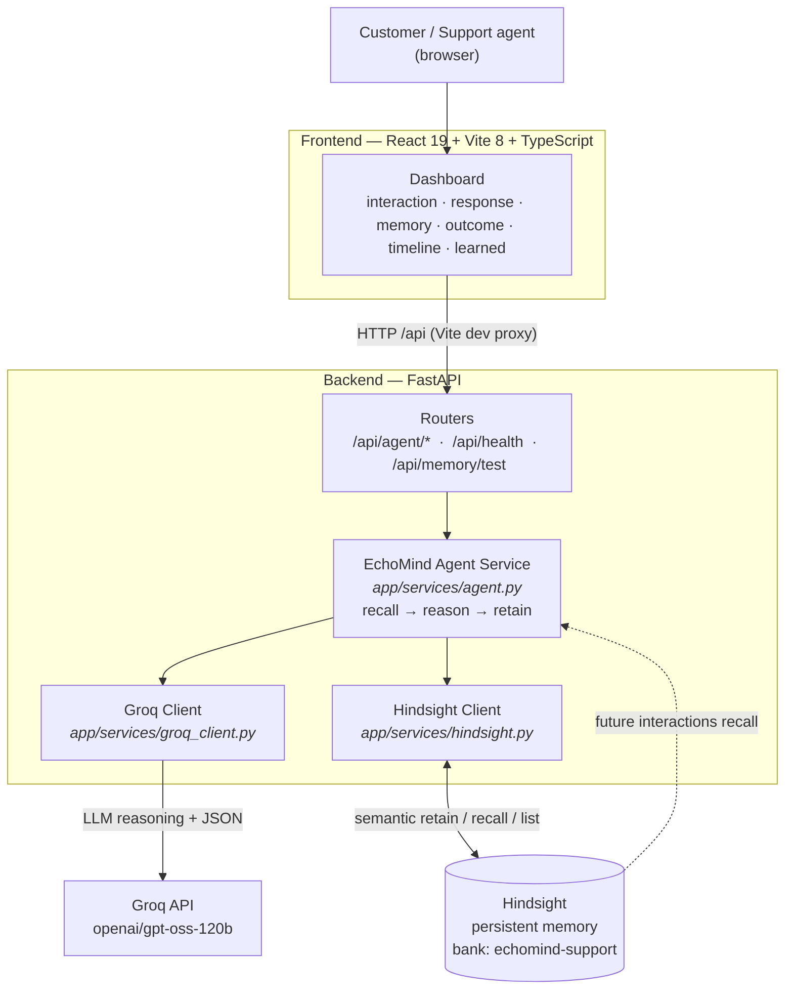
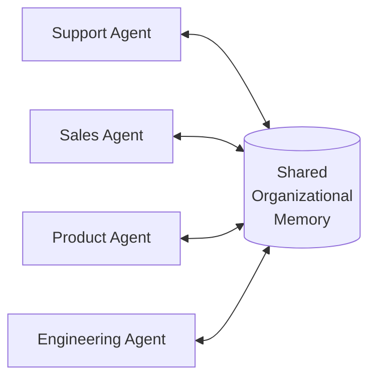
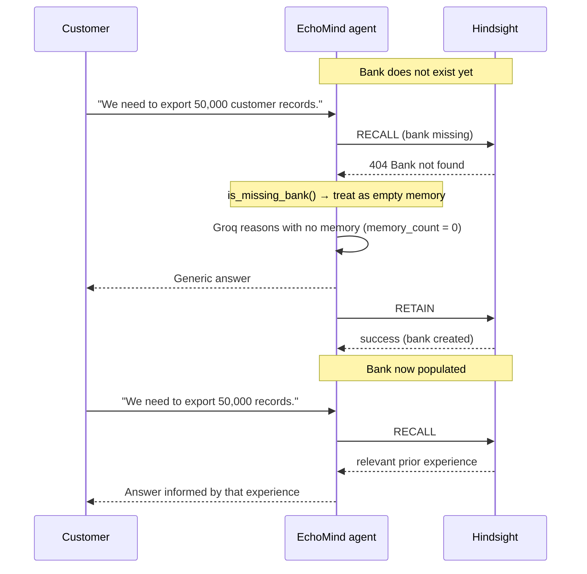

# EchoMind

> AI agents can answer. EchoMind helps them remember what the organization learned.


EchoMind is an **agentic AI system with persistent organizational memory** that enables AI
agents to learn from previous customer-support experiences and improve future decisions.

A conventional LLM assistant is a function of the current conversation. The moment the
conversation ends, everything it "learned" is gone. An organization that hits the same
problem repeatedly — a CSV export that times out, an integration that needs a specific
ordering, an escalation that was avoidable — pays to rediscover the same answer every
single time, because the individual model instance never carries the lesson forward.

EchoMind changes where knowledge lives. Instead of relying on a model instance to "remember,"
it retains each support experience and its outcome into an external persistent memory
(Hindsight), and recalls that organizational memory on every subsequent interaction. The
model weights never change. What changes is the evidence the model reasons over: the
organization's own accumulated track record of what worked and what failed.

The current implementation is a working prototype: a FastAPI backend, an agent loop that
recalls → reasons → retains, a React/Vite dashboard that makes the learning visible, and
two live verification scripts that prove the loop closes.

---

## Table of Contents

- [1. The Problem](#1-the-problem)
- [2. What Is EchoMind?](#2-what-is-echomind)
- [3. Core Concept: Organizational Memory](#3-core-concept-organizational-memory)
- [4. How EchoMind Works](#4-how-echomind-works)
- [5. The Learning Loop](#5-the-learning-loop)
- [6. Current Customer Support Use Case](#6-current-customer-support-use-case)
- [7. Current Features](#7-current-features)
- [8. Use Cases](#8-use-cases)
  - [A. Current Implementation](#a-current-implementation)
  - [B. Potential Future Use Cases](#b-potential-future-use-cases)
- [9. Why This Is Different From a Normal RAG Chatbot](#9-why-this-is-different-from-a-normal-rag-chatbot)
- [10. Why This Is Different From Fine-Tuning](#10-why-this-is-different-from-fine-tuning)
- [11. Tech Stack](#11-tech-stack)
- [12. Project Structure](#12-project-structure)
- [13. API](#13-api)
- [14. Memory Model](#14-memory-model)
- [15. First-Run Behavior](#15-first-run-behavior)
- [16. Demo Flow (~60 seconds)](#16-demo-flow-60-seconds)
- [17. Installation & Local Development](#17-installation--local-development)
- [18. Testing & Verification](#18-testing--verification)
- [19. Design Principles](#19-design-principles)
- [20. Limitations](#20-limitations)
- [21. Future Scope](#21-future-scope)
- [22. Security & Privacy Considerations](#22-security--privacy-considerations)
- [23. Contributing](#23-contributing)
- [24. License](#24-license)
- [25. Acknowledgements & Technology References](#25-acknowledgements--technology-references)
- [26. Hackathon Positioning](#26-hackathon-positioning)

---

## 1. The Problem

A normal LLM interaction is largely:

```
experience → response → conversation ends
```

The organization accumulates no reusable knowledge from that interaction. The same class of
problem returns months later, a different agent — or the same agent with an empty context
window — handles it, and the textbook answer is produced again.

A concrete sequence that happens constantly in enterprise support:

1. A customer requests a large export: *"We need to export 50,000 customer records."*
2. Support follows the standard procedure and runs the normal CSV export.
3. The export times out. The job fails. The case is escalated to engineering.
4. Engineering and support find a different approach that works — a background batched
   export that emails a download link.
5. That lesson lives in one case, in one engineer's head, in one Slack thread.
6. A future customer asks the same question. A stateless agent re-recommends the standard
   CSV export, because nothing in the organization said otherwise.
7. The failure repeats, along with the escalation, the customer impact, and the wasted time.

This is not a model capability problem. A frontier model can answer *"how do I export 50,000
records?"* perfectly well. The problem is **provenance**: the model has no access to what
*this specific organization* already tried, what failed here, and what actually worked.

It is worth being precise about one thing: EchoMind is **not** about remembering a user's
conversation history. Chat history is about continuity within one session. Organizational
memory is about accumulating institutional knowledge *across* sessions, agents, and
customers, where the source of each memory is a completed experience with a known outcome.

---

## 2. What Is EchoMind?

> **EchoMind is an agentic AI system with persistent organizational memory.**

It occupies three layers at once:

| Layer | EchoMind's position |
| --- | --- |
| **Primary domain** | Agentic AI — an LLM that acts, decides, and reports on its own reasoning |
| **Technical layer** | Persistent / long-term memory for AI agents, backed by Hindsight |
| **Business workflow** | Enterprise customer support / customer experience (CX) |

### EchoMind does NOT train the LLM's model weights

This distinction is the heart of the project. Learning here is **experience-based learning
through external persistent memory**, not parameter learning:

```
Experience
   ↓
Retain                      (Hindsight writes the experience)
   ↓
Organizational Memory
   ↓
Recall                      (Hindsight returns relevant prior experience)
   ↓
Reasoning                    (LLM reasons over current context + recalled memory)
   ↓
Action                      (a concrete recommendation to the customer)
   ↓
Outcome                     (what actually happened in the field)
   ↓
Retain again                (the outcome becomes new organizational memory)
```

The model is a fixed reasoning engine. Organizational memory is the growing, external,
inspectable store of evidence it reasons over.

---

## 3. Core Concept: Organizational Memory

Two different kinds of memory get conflated constantly:

| | Conversation memory | Organizational memory |
| --- | --- | --- |
| Says | *"I remember what **you** told me."* | *"I remember what **the organization** learned from previous experiences."* |
| Scope | One user, one session | All users, all sessions, all agents |
| Source | The current transcript | Completed interactions **with their outcomes** |
| Lifetime | Ends with the session | Persists indefinitely in Hindsight |
| Failure mode | Forgets mid-conversation | Never sees anything outside the current thread |
| EchoMind | Not the focus | **This is the system** |

Because each retained record is a *completed experience with an outcome*, knowledge from one
customer interaction can legitimately influence a later, unrelated customer interaction.

Taking the export example:

- **Customer A** asks to export 50,000 records. The agent has no prior experience with this,
  so it answers from general knowledge and recommends the standard CSV export.
- The **outcome** is recorded: the CSV export timed out twice and failed; a background batched
  export with a download link worked.
- That experience is retained in Hindsight.
- **Customer B** later asks to export 50,000 records. EchoMind recalls Customer A's experience
  and *explicitly avoids* the approach that already failed, telling the customer what went
  wrong and what worked instead.

Customer B never spoke to Customer A and never saw the escalated case. The organization
learned once; the next customer benefits. That is the entire thesis.

---

## 4. How EchoMind Works

### Architecture



### Components

| Component | Responsibility | Where |
| --- | --- | --- |
| **React/Vite dashboard** | Collects an interaction, shows the response, shows which memories were recalled, records outcomes, renders the learning timeline and organizational synthesis | `frontend/src/` |
| **FastAPI backend** | HTTP API, CORS, request/response validation, error translation | `backend/app/main.py`, `backend/app/routers/` |
| **EchoMind agent service** | The loop: recall → prompt → structured generation → retain. Owns the system prompts and memory formatting | `backend/app/services/agent.py` |
| **Groq client** | Async chat completions; JSON mode for the response envelope, plain text for the learning summary | `backend/app/services/groq_client.py` |
| **Hindsight client** | Thin async `httpx` wrapper over Hindsight's bank/memory REST API; single place where `HindsightError` originates | `backend/app/services/hindsight.py` |
| **Hindsight** | The persistent organizational memory store. Semantic recall over retained experiences, scoped by bank and tags | External service |

### Agent lifecycle

Implemented in `respond()` in `backend/app/services/agent.py`:

1. **Receive the interaction** — customer name and message, plus an optional bank and tag scope.
2. **Recall relevant organizational memory** — Hindsight semantic recall using the customer's
   message as the query (`budget="mid"`, `max_tokens=2048`, filtered by tags).
3. **Provide memory + current context to the LLM** — recalled memories are numbered and
   formatted, with an explicit instruction that they are institutional knowledge.
4. **LLM reasons** over the current situation and the recalled experience, returning a JSON
   envelope: `reasoning`, `memories_used` (0-based indices), and `response`.
5. **Generate the response** — the reply to the customer.
6. **Record the experience** — `record_outcome()` stores the lesson separately when a human
   reports what actually happened.
7. **Retain in Hindsight** — the interaction (and every recorded outcome) is written to the bank
   with a document ID, metadata, and tags.
8. **Future interactions recall it** — closing the loop.

The agent's system prompt (`AGENT_SYSTEM_PROMPT`) encodes the core policy: if a memory shows an
approach that **worked**, prefer it; if it **failed** (timeouts, errors, escalations, rework,
churn), do not recommend it again and steer to what did work; if it is **irrelevant**, ignore
it silently. It also forbids the agent from ever mentioning memory storage, databases, retrieval,
or being an AI model when speaking to a customer.

---

## 5. The Learning Loop

```
┌────────────────────┐
│     Experience     │   customer problem + what actually happened
└─────────┬──────────┘
          ↓
┌────────────────────┐
│   Recall Memory    │   Hindsight returns relevant prior experience
└─────────┬──────────┘
          ↓
┌────────────────────┐
│   LLM Reasoning    │   Groq weighs prior failures/successes
└─────────┬──────────┘
          ↓
┌────────────────────┐
│   Action / Answer  │   a recommendation that is not the generic one
└─────────┬──────────┘
          ↓
┌────────────────────┐
│      Outcome       │   did the recommendation actually work?
└─────────┬──────────┘
          ↓
┌────────────────────┐
│   Retain Lesson    │   written to Hindsight as organizational memory
└─────────┬──────────┘
          │
          └──────────▶ (loop back to Recall Memory on the next interaction)
```

**The learning is achieved through persistent memory, not model fine-tuning.** No gradients, no
training pipeline, no re-served model version. A lesson becomes available to future reasoning the
moment it is retained, and it can be inspected, corrected, or deleted as an ordinary record.

The `differs` check in `backend/tests/test_learning_loop.py` makes this falsifiable: the test
generates a **control** answer with memory deliberately withheld, then asserts that the
memory-aware answer is different.

---

## 6. Current Customer Support Use Case

This is the implemented workflow. Strings shown are either defined in the repository
(`backend/app/models/schemas.py`, `backend/tests/`) or clearly marked as illustrative prose;
generated LLM wording varies per run.

### Interaction 1 — empty organizational memory

**Customer A:** `We need to export 50,000 customer records.`

No memory exists for this bank yet. EchoMind's recall returns nothing, `memory_count` is `0`,
and `memories_used` is empty. The agent answers from general knowledge — a generic
recommendation about running a CSV export, likely with a caution about volume. It then retains
the interaction so the case is on record.

### Record the outcome

The real lesson arrives after the case is closed. The example lesson shipped in the codebase
(`backend/app/models/schemas.py`):

> `The standard CSV export timed out. A background batched export with secure download links worked.`

`POST /api/agent/outcome` retains this as its own document, with metadata
`source: "echomind-outcome"` and a `scenario` label, so the lesson is a first-class citizen of
memory rather than a comment bolted onto a transcript.

### Interaction 2 — same problem, new customer

**Customer B:** `We need to export 50,000 records.`

EchoMind recalls the previous experience and reasons over it. *Illustrative contrast — not
verbatim generated output:*

| | Answer given to the customer |
| --- | --- |
| **Without organizational memory** | Generic: "Use the standard CSV export; for large volumes, consider filters or contact support." |
| **With EchoMind memory** | Specific: "Our standard CSV export timed out on a request this size before. We use a background batched export that runs in chunks and emails you a secure download link — that is what worked on a comparable request." |

The second answer is *worse as generic advice and better as support*: it avoids an approach
this organization has already proven fails, and it does not ask the customer to discover the
timeout themselves.

The UI makes this visible: the memory panel shows each recalled memory, and the response panel
shows the model's own `reasoning` field describing which memories it used and how they changed
the answer.

---

## 7. Current Features

Everything in this section is implemented in the current repository.

| # | Feature | What it does | Where |
| --- | --- | --- | --- |
| 1 | **Customer interaction endpoint** | Accepts a customer name and message, runs the full loop, returns a structured envelope | `POST /api/agent/respond` · `routers/agent.py:36` · `services/agent.py:150` |
| 2 | **Memory recall** | Semantic recall against the configured bank, scoped by tags, `budget="mid"`, `max_tokens=2048` | `services/agent.py:67` `recall_knowledge()` |
| 3 | **Memory-aware LLM reasoning** | Numbered recalled memories plus current context are passed to Groq with a policy system prompt; response is requested as strict JSON | `AGENT_SYSTEM_PROMPT` · `generate()` |
| 4 | **Structured output** | `response_format={"type":"json_object"}`, with defensive parsing and explicit `GroqError` on non-JSON or unexpected shapes | `services/groq_client.py:23` |
| 5 | **Experience retention** | Every interaction is retained automatically; content is normalized to `Customer X reported: … / EchoMind responded: …` with a generated `document_id` | `retain_experience()` · `services/agent.py:103` |
| 6 | **Outcome recording** | A separate endpoint stores what actually happened as a distinct, labeled memory (`source: echomind-outcome`) | `POST /api/agent/outcome` · `record_outcome()` |
| 7 | **Organizational learning synthesis** | Recalls broadly and asks Groq for a plain-prose summary of what the organization has learned, with an explicit "never invent lessons" rule | `POST /api/agent/learned` · `summarize_learning()` |
| 8 | **Learning timeline** | Lists bank memories, groups them by `document_id`, and returns them newest-first with customer, source, timestamp, and lessons | `GET /api/agent/timeline` · `learning_timeline()` |
| 9 | **First-run empty-memory handling** | A missing bank is treated as "no memory yet" rather than an error, for both recall and timeline | `is_missing_bank()` · `services/agent.py:53` |
| 10 | **Memory attribution (`memories_used`)** | The model returns the indices it used; the API maps them to full `RecalledMemory` objects, falling back to all recalled memories if absent or invalid | `_select_used()` · `services/agent.py:141` |
| 11 | **Hindsight integration** | Async `httpx` client for retain / recall / list / health, with one error type carrying status and decoded detail | `services/hindsight.py` |
| 12 | **Groq integration** | Async Groq client; missing key fails fast with an actionable message | `services/groq_client.py` |
| 13 | **Health endpoint** | Reports app name and whether each API key is configured (booleans only — no secrets) | `GET /api/health` · `routers/health.py` |
| 14 | **Memory integration test endpoint** | Writes a unique marker document and recalls it, returning a `PASS`/`FAIL` verdict for the retain→recall cycle | `POST /api/memory/test` · `routers/memory.py` |
| 15 | **Upstream error transparency** | `HindsightError` → HTTP 502 including `hindsight_status` and `hindsight_response`; `GroqError` → HTTP 502. Nothing is silently swallowed | `_fail()` · `routers/agent.py:20` |
| 16 | **React/Vite dashboard** | Six-card console with connection status, a 3-step demo tracker, and per-panel empty states | `frontend/src/App.tsx` |
| 17 | **Memory visualization** | Each recalled memory is rendered with its type, context, document ID, and relevance score | `frontend/src/components/MemoryCard.tsx` |
| 18 | **Frontend error surfacing** | Distinguishes "the request never reached the backend" from a backend error, and unwraps nested Hindsight detail | `frontend/src/api.ts:14` `describeHttpError()` |
| 19 | **CORS configuration** | Origins parsed from `ALLOWED_ORIGINS` | `backend/app/main.py:13` |
| 20 | **Freshness/isolation in tests** | Each verification run uses a unique bank, tag, and document ID, and asserts every recalled memory came from the current run | `backend/tests/test_learning_loop.py:76` |

**Explicitly not implemented:** authentication, authorization, multi-tenant isolation, a
database, vector-embedding code written by this project (Hindsight handles embeddings),
multi-agent orchestration, memory editing/deletion, streaming, or fine-tuning.

---

## 8. Use Cases

The organizational-memory architecture is domain-agnostic. The mechanism — retain outcomes,
recall relevant experience, reason over it, avoid repeating failures — applies anywhere an
organization pays repeatedly for the same lesson.

### A. Current Implementation

| Domain | What is built today |
| --- | --- |
| **Customer support / CX** | Interaction intake, memory-aware recommendations, outcome recording, learning timeline, organizational synthesis. Bank default: `echomind-support` |

This is the only domain wired end to end. The agent's system prompt, the outcome schema, the
frontend wording, and the demo flow are all support-specific. The memory layer underneath is not.

### B. Potential Future Use Cases

> **Not implemented.** Each item below describes how the same memory substrate could be pointed
> at a different business domain. None of these workflows, prompts, or endpoints exist today.

**Customer support** — repeated problems, failed troubleshooting approaches, successful
resolutions, escalation patterns, and product-specific lessons across a support organization.

**Sales / deal intelligence** — previous objections and the responses that resolved them,
customer preferences, negotiation lessons, deal outcomes, and account-specific knowledge.
Memory becomes institutional sales craft rather than conversation history.

**Product management** — recurring customer requests aggregated over time, repeated pain
points, feature outcomes post-launch, and the reasoning behind product decisions.

**Engineering / incident response** — previous incidents, root causes, mitigation strategies,
failed fixes worth remembering, successful remediation, and service-specific operational
knowledge. Closest analogue to the current support domain.

**DevOps** — deployment failures, infrastructure incidents, successful rollback procedures,
and environment-specific lessons that are expensive to rediscover under pressure.

**Field service** — equipment problems, previous repair attempts, successful fixes, and
site-specific knowledge available to whoever is dispatched next.

**Enterprise onboarding** — configuration problems, integration lessons, previous onboarding
patterns, and the implementation approach that actually worked for accounts like this one.

**Compliance / audit** — previous audit findings, the remediation that cleared them,
organizational precedents, and repeated compliance issues with their established resolutions.

**Proposal / RFP intelligence** — previous proposals, winning approaches, customer
requirements, and reusable organizational knowledge about what lands with which buyer.

**AI agent teams** — the architectural endgame. Multiple specialized agents sharing one
organizational memory:



A support escalation teaches the engineering agent something; a repeated objection teaches
sales; a recurring defect teaches product. Requires auth, tenancy, memory governance, and
conflicting-knowledge handling — none of which exist today.

---

## 9. Why This Is Different From a Normal RAG Chatbot

Retrieval is genuinely part of EchoMind — the difference is **where knowledge comes from and
what happens to it over time**, not whether a vector search occurs.

**Traditional RAG**

1. A human curates a static document corpus.
2. A question arrives.
3. Relevant chunks are retrieved.
4. An answer is generated.
5. Nothing about that answer feeds back into the corpus. The corpus only changes when
   someone manually writes or edits a document, on a human schedule.

**EchoMind**

1. Experiences happen in the field, each with a real outcome.
2. Useful experience is retained automatically as a first-class memory record.
3. A future situation recalls that experience.
4. The agent reasons using organizational memory, and the system prompt instructs it to
   actively **avoid** approaches the memory says failed.
5. The new outcome creates an additional memory — the corpus grows from operations.

| Dimension | Traditional RAG | EchoMind |
| --- | --- | --- |
| Knowledge source | Human-authored documents | Outcomes of real experiences |
| Who decides what is stored | A human editor | The system, from completed cases |
| Feedback into the corpus | Manual | Automatic, from outcomes |
| Temporal driver | Document publishing | Operational experience |
| Use of prior failures | Rarely; documents record truths, not dead ends | Central; the agent is told to avoid them |
| Corpus growth rate | Bounded by human authoring | Bounded by support volume |
| Time dimension | Static snapshot | Recency-aware, timestamped |
| Answers outcomes | No | Yes — this is the input to the next memory |
| Retrieval itself | Yes | Yes (via Hindsight) — **not the differentiator** |

A useful test: a RAG chatbot's corpus is a *library*. EchoMind's memory is a *scar tissue* —
it records what hurt.

---

## 10. Why This Is Different From Fine-Tuning

| | Fine-tuning | EchoMind |
| --- | --- | --- |
| What changes | Model parameters | External memory store |
| Update latency | Hours to days (data prep + retrain + redeploy) | Immediate (one retain call) |
| Infrastructure | Training pipeline, GPU, model hosting | None — the model is untouched |
| Knowledge lifecycle | Baked into weights; hard to audit or edit | Inspectable, editable, deletable records |
| Cost of a wrong lesson | Retrain to remove it | Delete the record |
| New knowledge availability | Next model version | Next interaction |
| Per-customer/contextual nuance | Awkward — weights are global | Natural — banks and tags scope memory |
| Requires expertise | ML engineering | HTTP calls |

**Honest trade-offs.** Fine-tuning can change a model's *behavior* in ways in-context
examples cannot, and for a stable, high-volume, non-contextual pattern (tone, formatting,
domain terminology) it can be the better tool. EchoMind deliberately does not compete there.

What fine-tuning genuinely cannot do is accept a lesson at the moment it is learned and make it
available to the next interaction. A support outcome arrives in the middle of the day, attached
to a specific situation and a specific customer. EchoMind retains it immediately and the next
customer benefits. Also worth stating plainly: EchoMind does not claim to be "as good as
fine-tuning." It trades absolute model capability for an update cycle measured in milliseconds
and knowledge you can actually read.

---

## 11. Tech Stack

Everything listed here is present in the repository and used by the current implementation.

### Backend — `backend/`

| Technology | Version (pinned) | Use |
| --- | --- | --- |
| Python | 3.14 (local venv) | Runtime |
| FastAPI | `0.141.1` | HTTP API, OpenAPI docs at `/docs` |
| Uvicorn | `0.54.0` (`uvicorn[standard]`) | ASGI server, `--reload` in dev |
| Pydantic | via `pydantic-settings 2.15.0` | Request/response models and settings |
| pydantic-settings | `2.15.0` | `BaseSettings` with `.env` loading |
| httpx | `0.28.1` | Async Hindsight REST client |
| groq | `1.7.0` | `AsyncGroq` chat completions |

Declared in `backend/requirements.txt` — five pinned dependencies, nothing else.

### AI

| Technology | Use |
| --- | --- |
| **Groq** | All LLM calls: the memory-aware response and the learning summary |
| **`openai/gpt-oss-120b`** | Default model (`GROQ_MODEL` in `backend/app/config.py`) |
| **JSON structured output** | `response_format={"type": "json_object"}` for the response envelope |
| **Low temperature** | `0.2` for responses, `0.3` for synthesis — keeps memory-grounded output stable |

### Memory

| Technology | Use |
| --- | --- |
| **Hindsight** | Persistent memory: semantic retain, recall, and list across a tagged bank |

### Frontend — `frontend/`

| Technology | Version | Use |
| --- | --- | --- |
| React | `19.2` | UI |
| React DOM | `19.2` | Rendering |
| Vite | `8.3` | Dev server, build, `/api` proxy |
| TypeScript | `~6.0` | Strict-typed API client and components |
| `@vitejs/plugin-react` | `6.1` | React fast refresh |
| oxlint | `1.81` | Linting (`npm run lint`) |

No UI component library, no state-management library, no CSS framework — `index.css` is
hand-written.

### Testing

| Mechanism | Detail |
| --- | --- |
| Executable verification scripts | `backend/tests/test_first_run.py`, `backend/tests/test_learning_loop.py` |
| Framework | None — no pytest, no mocking. They run the real agent loop against live Hindsight and Groq |
| Linting | `oxlint` (frontend) |
| Type checking | `tsc -b` as part of `npm run build` |
| Assertions | Named boolean checks, printed in a table; exit code `0` on pass, `1` on fail |

### Not used

No LangChain, no LangGraph, no vector database of our own, no message queue, no relational
database, no Docker, no CI, no cloud SDKs. The agent loop is ~130 lines of plain async Python
and `httpx`.

---

## 12. Project Structure

```
echomind/
├── .env.example                  # Template for all environment variables
├── .gitignore                    # Ignores .env*, .venv/, node_modules/, dist/, __pycache__/
├── README.md                     # This file
│
├── backend/
│   ├── requirements.txt          # 5 pinned Python dependencies
│   ├── .env                      # Local secrets copy (gitignored) — see setup note
│   ├── app/
│   │   ├── __init__.py
│   │   ├── main.py               # FastAPI app, CORS, router registration, GET /
│   │   ├── config.py             # Settings: keys, model, Hindsight URL, bank ID, CORS origins
│   │   ├── models/
│   │   │   ├── __init__.py
│   │   │   └── schemas.py        # Pydantic request/response models for every endpoint
│   │   ├── routers/
│   │   │   ├── __init__.py
│   │   │   ├── health.py         # GET /api/health
│   │   │   ├── memory.py         # POST /api/memory/test — retain→recall integration check
│   │   │   └── agent.py          # /respond, /outcome, /learned, /timeline + error mapping
│   │   └── services/
│   │       ├── __init__.py
│   │       ├── agent.py          # The learning loop: prompts, recall, generate, retain,
│   │       │                     #   outcome, synthesis, timeline, is_missing_bank()
│   │       ├── groq_client.py    # AsyncGroq wrapper; complete_json() and complete_text()
│   │       └── hindsight.py      # HindsightClient: retain / recall / list_memories / health
│   └── tests/
│       ├── test_first_run.py     # Missing-bank first-run behavior (9 checks)
│       └── test_learning_loop.py # End-to-end learning loop (8 checks)
│
└── frontend/
    ├── package.json              # React/Vite/TS deps and scripts
    ├── .env.example              # VITE_API_BASE_URL
    ├── vite.config.ts            # React plugin + /api proxy → 127.0.0.1:8000
    ├── index.html
    ├── tsconfig.json / tsconfig.app.json / tsconfig.node.json
    ├── .oxlintrc.json
    └── src/
        ├── main.tsx              # React entry point
        ├── App.tsx               # Dashboard state, demo flow, 3-step tracker
        ├── api.ts                # Typed fetch client, error unwrapping, API_ORIGIN
        ├── types.ts              # TypeScript mirrors of the backend schemas
        ├── index.css             # Full dashboard styling
        ├── public/favicon.svg
        └── components/
            ├── Masthead.tsx      # Title, experience count, backend connection status
            ├── InteractionCard.tsx # Customer/message input + "Ask EchoMind" + demo case buttons
            ├── ResponseCard.tsx   # The reply + the model's reasoning
            ├── MemoryCard.tsx     # Recalled memories with type/context/doc-id/score
            ├── OutcomeCard.tsx    # Record what actually happened; shows retention status
            ├── LearnedCard.tsx    # "What has EchoMind learned?" synthesis
            └── TimelineCard.tsx   # Newest-first learning timeline
```

### Where to make changes

| Goal | File |
| --- | --- |
| Change agent behavior/policy | `backend/app/services/agent.py` → `AGENT_SYSTEM_PROMPT` |
| Change synthesis behavior | `backend/app/services/agent.py` → `LEARNED_SYSTEM_PROMPT` |
| Add an endpoint | `backend/app/routers/` + schema in `backend/app/models/schemas.py` |
| Change what is stored | `backend/app/services/agent.py` → `retain_experience()` |
| Change the model or bank | `backend/app/config.py` or `.env` |
| Change Hindsight paths/options | `backend/app/services/hindsight.py`, `recall_knowledge()` |
| Change the UI | `frontend/src/components/` |
| Change the demo flow | `frontend/src/App.tsx` |

---

## 13. API

Base URL: `http://127.0.0.1:8000`. Interactive OpenAPI docs: `http://127.0.0.1:8000/docs`.

All endpoints are currently unauthenticated.

### Product endpoints

#### `POST /api/agent/respond` — run the memory-aware agent

Recall organizational memory, reason with Groq, answer, and retain the interaction.

**Request**

| Field | Type | Required | Default | Description |
| --- | --- | --- | --- | --- |
| `customer` | string | no | `"Customer"` | Customer identifier |
| `message` | string | **yes** | — | The customer's message; also used as the recall query |
| `bank_id` | string \| null | no | `HINDSIGHT_BANK_ID` | Memory bank override |
| `tags` | string[] \| null | no | `[bank_id]` | Recall filter (`tags_match="any"`) |

```bash
curl -X POST http://127.0.0.1:8000/api/agent/respond \
  -H "Content-Type: application/json" \
  -d '{
    "customer": "Customer A",
    "message": "We need to export 50,000 customer records."
  }'
```

**Response** (`AgentResponse`)

| Field | Type | Description |
| --- | --- | --- |
| `customer` | string | Echoed customer |
| `response` | string | The reply to the customer |
| `memories_used` | `RecalledMemory[]` | Memories the model cited by index; falls back to all recalled |
| `memory_count` | integer | Total memories returned by recall |
| `reasoning` | string \| null | Which memories were used and how they changed the answer |
| `bank_id` | string | Bank actually used |
| `retained` | boolean | Whether the Hindsight retain succeeded |
| `retained_document_id` | string \| null | ID of the document just written |
| `raw_memories` | object[] | Unfiltered recall payload (debugging/inspection) |

`RecalledMemory`: `id`, `text`, `type`, `context`, `document_id`, `metadata`, `score`
(`score` is the Hindsight `scores.final` value).

```json
{
  "customer": "Customer A",
  "response": "For exports of this size our standard CSV export has timed out before...",
  "memories_used": [],
  "memory_count": 0,
  "reasoning": "No relevant organizational memory was available, so I answered from general product knowledge.",
  "bank_id": "echomind-support",
  "retained": true,
  "retained_document_id": "echomind-1a2b3c4d5e6f",
  "raw_memories": []
}
```

#### `POST /api/agent/outcome` — record what actually happened

Stores a lesson as a distinct, labeled memory.

| Field | Type | Required | Description |
| --- | --- | --- | --- |
| `customer` | string | no | Customer identifier |
| `lesson` | string | **yes** | What happened and what worked |
| `scenario` | string \| null | no | Optional scenario label stored in metadata |
| `bank_id` | string \| null | no | Bank override |
| `tags` | string[] \| null | no | Tag filter |

```bash
curl -X POST http://127.0.0.1:8000/api/agent/outcome \
  -H "Content-Type: application/json" \
  -d '{
    "customer": "Customer A",
    "scenario": "CSV export timeout on 50,000 records",
    "lesson": "The standard CSV export timed out. A background batched export with secure download links worked."
  }'
```

**Response** (`OutcomeResponse`): `retained` (bool), `document_id` (string),
`lesson` (string), `bank_id` (string).

```json
{
  "retained": true,
  "document_id": "outcome-9f8e7d6c5b4a",
  "lesson": "The standard CSV export timed out. A background batched export with secure download links worked.",
  "bank_id": "echomind-support"
}
```

#### `POST /api/agent/learned` — what has the organization learned?

Recalls broadly across the bank and asks Groq to synthesize the lessons in plain prose.

| Field | Type | Required | Description |
| --- | --- | --- | --- |
| `question` | string \| null | no | Defaults to *"lessons, outcomes and proven approaches learned from customer support experience"* |
| `bank_id` | string \| null | no | Bank override |
| `tags` | string[] \| null | no | Tag filter |

```bash
curl -X POST http://127.0.0.1:8000/api/agent/learned \
  -H "Content-Type: application/json" \
  -d '{}'
```

**Response** (`LearnedResponse`): `summary` (string), `memory_count` (integer),
`memories` (object[]). When no memory is found, `summary` is an empty string.

#### `GET /api/agent/timeline` — learning timeline

Lists bank memories and groups them by document, newest first. Optional query parameter:
`bank_id`.

```bash
curl "http://127.0.0.1:8000/api/agent/timeline"
```

**Response** (`TimelineResponse`): `entries` (`TimelineEntry[]`), `count` (integer),
`bank_id` (string).

`TimelineEntry`: `id` (the `document_id`), `customer`, `source` (e.g. `echomind-agent`,
`echomind-outcome`), `occurred_at` (string \| null), `lessons` (string[]).

```json
{
  "entries": [
    {
      "id": "outcome-9f8e7d6c5b4a",
      "customer": "Customer A",
      "source": "echomind-outcome",
      "occurred_at": "2026-09-29T10:14:02Z",
      "lessons": ["The standard CSV export timed out. A background batched export worked."]
    }
  ],
  "count": 1,
  "bank_id": "echomind-support"
}
```

### Service and development endpoints

#### `GET /api/health` — configuration check

```json
{ "status": "ok", "app": "EchoMind", "groq_configured": true, "hindsight_configured": true }
```

Reports only whether keys are present. Never returns a key value.

#### `GET /` — service root

```json
{ "app": "EchoMind", "docs": "/docs" }
```

#### `POST /api/memory/test` — retain→recall integration check

> **Development endpoint.** Writes to the fixed bank `echomind-dev-test` using a unique
> `document_id` and `run_id` marker. Do not call it in production; it is designed to confirm
> connectivity and write a synthetic test record.

Takes no request body. Writes a document containing a unique marker
(`ECHODEV-<run_id>`) plus decoy signals, then recalls it and verifies the marker or a signal
reappears.

```json
{
  "verdict": "PASS",
  "run_id": "d176369b0e9b",
  "bank_id": "echomind-dev-test",
  "marker": "ECHODEV-d176369b0e9b",
  "retain": { "ok": true, "items_count": 1, "async": false, "usage": { "total_tokens": 0 } },
  "recall": { "ok": true, "query": "...", "result_count": 2, "matched_marker_or_signal": true, "results": [] }
}
```

### Error format

Hindsight and Groq failures are surfaced as HTTP `502` with the upstream detail preserved:

```json
{
  "detail": {
    "error": "Hindsight POST /v1/default/banks/.../memories failed with HTTP 401",
    "hindsight_status": 401,
    "hindsight_response": { "detail": "..." }
  }
}
```

Only one failure mode is *not* an error: recall or list against a bank that does not exist yet
(see [First-Run Behavior](#15-first-run-behavior)).

---

## 14. Memory Model

### What is stored

EchoMind stores **normalized experience records**, not raw conversation dumps. Every retained
record is built as:

```
Customer {customer} reported: {message}
EchoMind responded: {response}
```

with `context: "EchoMind customer support interaction"` and an attached `scenario` when an
outcome supplies one. This shape is deliberate: a compressed experience is more likely to be
retrieved and less likely to leak conversational noise into future reasoning.

### Record structure

| Field | Purpose | Example |
| --- | --- | --- |
| `content` | The experience itself | `Customer A reported: We need to export 50,000 customer records.\nEchoMind responded: ...` |
| `context` | Framing so Hindsight knows what kind of knowledge this is | `EchoMind customer support interaction` |
| `document_id` | Stable identity, also the timeline grouping key | `echomind-1a2b3c4d5e6f` / `outcome-9f8e7d6c5b4a` |
| `metadata.customer` | Who the experience involved | `Customer A` |
| `metadata.source` | Whether it is an interaction or an outcome | `echomind-agent` / `echomind-outcome` |
| `metadata.scenario` | Optional scenario label (outcomes) | `csv-export-timeout` |
| `metadata.run_id` | Test-run isolation marker (verification scripts only) | `8b5e8582e905` |
| `tags` | Scope for recall; defaults to the bank ID | `["echomind-support"]` |

The two `document_id` prefixes — `echomind-` for interactions and `outcome-` for recorded
lessons — make the timeline readable and let a future cleanup job tell the two apart.

### Situation, action, outcome, lesson

A complete support experience decomposes into:

- **Situation / context** — what the customer reported (`message`, `scenario`)
- **Action** — what EchoMind recommended (`response`)
- **Outcome** — what actually happened in the field, recorded separately
- **Lesson** — the durable takeaway, which is what makes the record useful to a future agent
  that never saw the case

EchoMind does not run a separate LLM extraction step to split these fields. The structure comes
from *where* a record originates — an interaction record versus an outcome record — which keeps
the write path simple and every record traceable to a real event.

### Why semantic recall helps

A future customer will not use Customer A's exact words. Hindsight embeds the retained
experience and returns it by *meaning*, so "we need to export 50,000 records" retrieves a record
written as "the standard CSV export timed out". Keyword search would miss it; semantic recall
does not. Recall is scoped to the bank and filtered by tags, which is what keeps one tenant's
or one test run's memories out of another's.

---

## 15. First-Run Behavior

A fresh EchoMind deployment points at a Hindsight bank that does not exist yet. Hindsight creates
banks lazily on first write, so a recall against a never-written bank legitimately returns
`404 Bank "<id>" not found`. That is "no memory yet", not a failure.



`is_missing_bank()` (`backend/app/services/agent.py:53`) is deliberately narrow. It returns
`True` **only** when the status code is `404` **and** the requested bank ID appears in the
error detail. Everything else still raises:

| Condition | Behavior |
| --- | --- |
| 404 naming the requested bank | Treated as empty memory |
| 401 / 403 | Raises → HTTP 502 |
| 422 | Raises → HTTP 502 |
| 500 | Raises → HTTP 502 |
| 404 for a *different* bank / unrelated 404 | Raises → HTTP 502 |
| Network error, timeout, DNS failure | Raises → HTTP 502 |

This matters. A blanket `except: return []` would let an expired API key masquerade as "this
organization has no history", which would silently destroy the core value proposition while
looking perfectly healthy. First-run friendliness must not come at the cost of hiding real
infrastructure failures.

Both `recall_knowledge()` and `learning_timeline()` apply this handling, so a new deployment
starts with an empty dashboard rather than an error screen.

---

## 16. Demo Flow (~60 seconds)

Setup before starting: make sure the demo bank is empty of prior lessons, or at least be aware
that existing memory will be recalled too. Each run should use a fresh bank for the cleanest
contrast.

| # | Action | What to show |
| --- | --- | --- |
| 1 | Click **Use first case** → **Ask EchoMind** | First response. Point at the memory panel: *"No prior experience was relevant to this interaction."* |
| 2 | Read the response | A generic large-export recommendation — this is the "before" |
| 3 | In **Newly Learned Experience**, record the outcome: the standard CSV export timed out; a background batched export with a download link worked | Outcome recorded, `Retained` chip appears |
| 4 | Point at the **Learning Timeline** | A new entry just appeared — memory was actually written |
| 5 | Click **Use similar future case** → **Ask EchoMind** | The **Memory recalled** state. Four memories listed, each with context and relevance score |
| 6 | Read the model's reasoning and the response | It now names what failed before and recommends the batched approach |
| 7 | Click **What has EchoMind learned?** | An organizational summary in plain prose, with a memory count |
| 8 | The demo tracker at the top | All three steps are marked done: record → recall → learning |

**What a judge should notice**

- Step 1 vs step 6: the *same class of question* gets a materially different answer, and the
  difference is traceable to a specific remembered failure.
- The answer in step 6 is not "smarter text" — it is a specific recommendation the organization
  actually proved, and it avoids a path the organization already knows is broken.
- Memory is **visible and inspectable**: individual records with type, context, and source, plus a
  timeline. Not a black box claiming to remember.
- Learning is **improvable and correctable**: the outcome step is where a human injects ground
  truth, and the next interaction reflects it. There is no retraining step between the two.
- The empty-memory state is handled honestly rather than by faking recollection.

---

## 17. Installation & Local Development

### Prerequisites

- **Python 3.14** (3.11+ should work; 3.14 is what this repo was built and tested against)
- **Node.js 20+** and npm
- A **Groq API key**
- A **Hindsight API key** — <https://hindsight.vectorize.io>
- A Hindsight base URL (default in `.env.example`: `https://api.hindsight.vectorize.io`)

### Environment variables

Copy the template and fill in real values. `.env` is gitignored and must never be committed.

```bash
cp .env.example .env
```

| Variable | Default in `config.py` | Required | Description |
| --- | --- | --- | --- |
| `HINDSIGHT_API_KEY` | `""` | **yes** | Hindsight bearer token |
| `HINDSIGHT_BASE_URL` | `https://api.hindsight.vectorize.io` | no | Hindsight API origin |
| `HINDSIGHT_BANK_ID` | `echomind-support` | no | Organizational memory bank |
| `GROQ_API_KEY` | `""` | **yes** | Groq API key |
| `GROQ_MODEL` | `openai/gpt-oss-120b` | no | Model used for reasoning and synthesis |
| `APP_NAME` | `EchoMind` | no | Reported by `/` and `/api/health` |
| `DEBUG` | `false` | no | Reserved app flag |
| `API_PREFIX` | `/api` | no | Prefix for all routes |
| `ALLOWED_ORIGINS` | `http://localhost:5173,http://127.0.0.1:5173` | no | Comma-separated CORS origins |

Example `.env` (placeholders only):

```dotenv
GROQ_API_KEY=your_groq_api_key_here
GROQ_MODEL=openai/gpt-oss-120b

HINDSIGHT_API_KEY=your_hindsight_api_key_here
HINDSIGHT_BASE_URL=https://api.hindsight.vectorize.io
HINDSIGHT_BANK_ID=echomind-support
```

### Create the virtual environment

```powershell
python -m venv .venv
.\.venv\Scripts\Activate.ps1
pip install -r backend\requirements.txt
```

### Start the backend

Run from the **repository root** so the root `.env` is picked up (`config.py` loads `.env`
relative to the current working directory).

```powershell
.\.venv\Scripts\python.exe -m uvicorn app.main:app --reload --app-dir backend --port 8000
```

- API: `http://127.0.0.1:8000`
- OpenAPI docs: `http://127.0.0.1:8000/docs`
- Health: `http://127.0.0.1:8000/api/health`

### Start the frontend

In a second terminal, from `frontend/`:

```powershell
cd frontend
npm install
npm run dev
```

- Dashboard: `http://localhost:5173`
- `/api` requests are proxied to `http://127.0.0.1:8000` (`frontend/vite.config.ts`), so no
  CORS configuration is needed in dev. To call a deployed backend directly, set
  `VITE_API_BASE_URL` in `frontend/.env` and add that origin to `ALLOWED_ORIGINS`.

### Other scripts

| Command | Effect |
| --- | --- |
| `npm run build` | Type-check (`tsc -b`) and build to `dist/` |
| `npm run lint` | Run oxlint |
| `npm run preview` | Serve the production build locally |

### Two notes on setup

1. **`.env` location matters.** `config.py` uses `env_file=".env"`, resolved against the process
   working directory. This repository currently contains a secrets copy at both the root and
   `backend/.env` so that the app starts from either directory. Launch from the repository root
   and keep a single authoritative copy to avoid editing the wrong file.
2. **Banking is lazy.** You do not need to create the Hindsight bank by hand. The first successful
   retain creates it.

---

## 18. Testing & Verification

There is **no pytest suite and no mocking layer**. The two files in `backend/tests/` are
standalone `asyncio` scripts that exercise the real agent loop against live Hindsight and live
Groq, print a named check table, and exit `0` on success or `1` on failure.

Both require valid API keys in `.env` and both **write real data to Hindsight**. Each run uses a
unique bank and tag, so runs stay isolated from each other and from the demo bank.

```powershell
# from the repository root, venv active
.\.venv\Scripts\python.exe backend\tests\test_learning_loop.py
.\.venv\Scripts\python.exe backend\tests\test_first_run.py
```

### `test_learning_loop.py` — does memory actually change the answer?

**Scenario.** Seeds a *failed* approach for Customer A, then sends the same request from
Customer B through the real `respond()` loop, and finally generates a **control** answer with
memory deliberately withheld.

The seeded failure is defined in the test itself:

> *"We tried the standard CSV export and it timed out twice, then the job failed. Escalated to
> engineering. The fix that worked was a background batched export that runs in chunks and emails
> a download link when it completes."*

**8 checks**

| Check | What it proves |
| --- | --- |
| retain seeded | The prior experience was actually written |
| memory recalled | Semantic recall found it from a reworded request |
| memories are from this run only | **Stale-memory isolation** — every recalled memory carries this run's `run_id` |
| model cited memories by index | **Memory attribution** — the model selected memories, not just received them |
| response warns about the failure | The model used the memory to *avoid* a known-bad approach |
| response proposes learned batched/background remedy | It steered to what actually worked |
| response mentions the emailed download link | The specific successful detail survived |
| memory-aware answer differs from control | **Attribution over coincidence** — the memory changed the output |

The last check is the important one. Without it, a "PASS" could just mean the model happened to
mention a timeout. Comparing against a memory-free control isolates the effect of memory.

### `test_first_run.py` — does a new deployment survive its first interaction?

**Scenario.** Creates a bank name that does not exist, then walks the full lifecycle and asserts
each stage. Uses `We need to export 50,000 customer records.` followed by
`We need to export 50,000 records.` — a deliberately reworded follow-up.

**9 checks**

| Check | What it proves |
| --- | --- |
| bank absent before test | The first-run scenario is genuine, not accidentally pre-populated |
| raw recall 404s on missing bank | The 404 being handled is real |
| first interaction: no memory, no error | Empty memory is a normal state, and `is_missing_bank()` recognizes the 404 |
| first interaction: Groq answered | The agent still functions with zero memory |
| first interaction: retain succeeded | The experience was written |
| bank created by first retain | Hindsight provisioned the bank lazily, as expected |
| second interaction: memory recalled | The reworded question retrieved the prior experience |
| second interaction: memory used | Attribution is populated, not empty |
| second interaction differs from first | Visible behavioral change from the memory |

### Verification philosophy

| Principle | How it is enforced |
| --- | --- |
| **Prove the substrate first** | `POST /api/memory/test` isolates retain→recall from the agent loop entirely |
| **Control for coincidence** | The learning-loop test compares against a memory-free answer |
| **Isolate from stale data** | Unique bank, tag, `document_id`, and `run_id` per run, asserted on the way back |
| **Test the failure path, not just the happy path** | The first-run test asserts the raw 404 and that genuine errors are *not* swallowed |
| **Assert behavior, not prose** | Checks look for failure warnings and the specific learned remedy, not exact wording |

**Honest status.** The last recorded runs of both scripts passed. The frontend builds and
type-checks cleanly, with oxlint reporting a single `react(set-state-in-effect)` warning in
`App.tsx:45` for the initial timeline fetch. There is **no automated browser/E2E test** for the
frontend, so the full demo path through the running Vite proxy has not been verified
automatically — it is a manual demo flow.

---

## 19. Design Principles

1. **Memory is central, not decorative.** If memory did not change the answer, it would not be
   in the system. The control comparison in the learning-loop test exists to enforce this.
2. **Experiences must become reusable organizational knowledge.** A record that only makes sense
   inside the conversation that produced it is a transcript, not memory. Records are normalized
   for future retrieval.
3. **Outcomes matter.** The recommendation is a hypothesis; the recorded outcome is the evidence.
   Retaining only the response would teach the agent to repeat itself confidently.
4. **Retrieved memory must influence reasoning.** `memories_used` makes attribution explicit and
   inspectable instead of hoping the prompt worked.
5. **First-run behavior must be safe.** A new deployment must not crash on its first interaction.
   Handle the missing-bank 404 narrowly, and only that.
6. **Do not hide genuine infrastructure errors.** An expired key or an upstream 500 must surface
   loudly. A blanket exception handler that turns failures into "no memory" is worse than a
   crash: it produces a confident, wrong, silently memoryless agent.
7. **Keep memory separate from model weights.** Knowledge should be inspectable, editable, and
   deletable without touching the model.
8. **Keep the system simple and inspectable.** No agent framework, no vector store of our own, no
   message queue. The entire loop is readable in one file, and every retained record can be
   listed and read.
9. **Show the learning.** The timeline and the memory panel exist so a human can audit what the
   system believes and correct it.

---

## 20. Limitations

Stated plainly, because a prototype that hides its limits is harder to build on.

| Limitation | Detail |
| --- | --- |
| **Single workflow** | Only customer support is wired end to end. Prompts, schemas, and UI are support-specific. |
| **Memory quality depends on what is retained** | If outcomes are not recorded, memory degrades into a transcript log. There is no automated extraction from case systems. |
| **No memory editing or deletion** | No API or UI to correct a wrong lesson. Removing bad knowledge today means going to Hindsight directly. |
| **No memory governance** | No conflict detection between two contradictory lessons, no confidence scoring, no expiry. A stale lesson stays retrievable. |
| **LLM reasoning can still be wrong** | The agent can misread a memory, over-generalize a single incident, or misattribute success. |
| **Retrieval relevance is imperfect** | Semantic recall is ranked, not exact. A highly relevant lesson can be outranked, and an irrelevant one can be returned. The prompt mitigates this; it does not fix it. |
| **No evaluation framework** | The learning-loop test checks one scenario with regexes. There is no regression suite, no benchmark, no accuracy metric. |
| **Unauthenticated** | Every endpoint is open. Anyone who can reach the API can read and write organizational memory. |
| **Single logical tenant** | Isolation is by bank/tag convention, not enforced. `bank_id` and `tags` are caller-supplied. |
| **Synchronous request path** | Recall, reasoning, and retain all happen inline. No streaming, no background processing, no queue. |
| **Prototype, not a production platform** | No observability, no rate limiting, no retries with backoff, no deployment or CI configuration, no database. |
| **Multi-agent teams are not implemented** | Section 8 describes an architectural direction, nothing more. |
| **Frontend E2E is unverified** | No automated browser test; the demo path is manual. |

---

## 21. Future Scope

All of the following is **roadmap, not current functionality**.

### Near term — memory quality

- **Memory confidence and relevance** — surface retrieval scores and let the agent or a human
  judge how strongly a lesson should be applied.
- **Better experience/outcome extraction** — an explicit LLM step that decomposes a case into
  situation / action / outcome / lesson, rather than relying on record origin.
- **Memory editing and deletion** — correct a wrong lesson without leaving the product.
- **Improved UI** — memory inspection, filtering, and a clearer diff between memory-aware and
  memory-free answers.
- **More realistic support workflows** — multi-turn cases, multiple customers, escalation chains.
- **More use cases** — incident response and sales, the two nearest neighbours of the current
  domain.

### Medium term — shared memory and governance

- **Shared organizational memory across specialized agents** — support, sales, and product
  agents reading and writing one governed memory layer.
- **Memory governance** — who may write organizational knowledge, review queues for
  human-supplied lessons, and an audit trail of every write.
- **Memory provenance** — full lineage for each memory: which case, which outcome, who recorded
  it, when it was superseded.
- **Feedback loops** — automated outcome ingestion from case-management systems instead of
  relying on someone to type the lesson.
- **Evaluation framework** — a labeled scenario suite measuring whether memory improves answers,
  so memory changes can be regression-tested instead of eyeballed.
- **Analytics** — which lessons are recalled most, which recommendations succeed, where the
  organization repeatedly fails.

### Long term — an organizational memory layer

- **Organization-wide agent memory layer** — one memory substrate serving every agent the
  company runs.
- **Cross-department learning** — support learns from engineering; sales learns from support
  escalations; product learns from both.
- **Agent-to-agent knowledge sharing** — agents contributing lessons to a common store and
  benefiting from each other's experience.
- **Memory policies** — retention, expiry, region and sensitivity rules per bank.
- **Enterprise permissions** — authentication, role-based access, and tenant isolation.
- **Human approval workflows** — lessons flagged low-confidence require review before they can
  change customer-facing answers.
- **Full memory lifecycle management** — creation, review, expiry, supersession, and archival.
- **Domain-specific organizational knowledge** — structured memory for regulated or
  domain-critical domains, where recall must be traceable to an approved source.
- **Continuous learning from operational outcomes** — the loop running unattended, with outcomes
  flowing back as ground truth and drift detected over time.

---

## 22. Security & Privacy Considerations

**Current posture.** EchoMind is a local prototype. There is no authentication, no
authorization, no encryption beyond HTTPS in transit to the upstream APIs, and no database.

### What is true today

- **Secrets live in environment variables only.** `GROQ_API_KEY` and `HINDSIGHT_API_KEY` are
  read from the environment by `pydantic-settings` and are never hardcoded.
- **Secrets are excluded from source control.** `.gitignore` ignores `.env` and `.env.*` while
  explicitly re-allowing `.env.example`, which contains placeholders only.
- **`/api/health` cannot leak a key.** It returns booleans indicating whether keys are
  configured, never values.
- **Fail-fast on missing credentials.** Both clients raise a clear, actionable error rather than
  silently degrading.
- **CORS is configurable** via `ALLOWED_ORIGINS`, defaulting to the Vite dev origins.
- **Upstream errors are surfaced, not hidden.** Including Hindsight response bodies in `502`
  details is useful in development but is exactly the kind of thing that must be reviewed
  before any internet exposure.

### What is required before this is deployed anywhere real

| Area | Requirement |
| --- | --- |
| **Authentication** | No endpoint is protected. Add real authentication before exposing any of this. |
| **Authorization** | `bank_id` and `tags` are caller-supplied, so any caller can read or write any bank. Enforce server-side scoping. |
| **Sensitive customer data** | Retained records contain customer messages and names verbatim. Retention, redaction, and encryption policies are required before real customer data enters the memory store. |
| **Memory access control** | Organizational memory may encode escalation paths, internal failure detail, and process weaknesses. It needs the same protection as a case-management system. |
| **Data retention and deletion** | No deletion path exists. Right-to-erasure and contractual deletion obligations need a supported mechanism. |
| **Error detail** | Review the `hindsight_response` passthrough before external exposure. |
| **Audit logging** | No record of who read or wrote organizational memory. Required for regulated use. |
| **PII minimization** | A production system should decide what is worth remembering before it is written, not after. |

---

## 23. Contributing

EchoMind is small and readable by design. Contributions that fit the project:

1. **Keep the loop inspectable.** Prefer a clear, direct implementation over a framework. If a
   dependency is genuinely necessary, justify it in the PR.
2. **Never weaken error handling.** A new `except` that converts an infrastructure failure into an
   empty result is a regression, even if it makes a demo smoother.
3. **Add verification, not just code.** New behavior should come with a named check in
   `backend/tests/`, in the same style as the existing scripts.
4. **Keep memory and weights separate.** New capabilities should extend the memory layer, not
   reach for fine-tuning.
5. **Match the code style.** Async-first, explicit types, `from __future__ import annotations` in
   backend modules, one clear responsibility per service function.
6. **Never commit secrets.** Verify `.env` is ignored before committing.

Local checks before opening a PR:

```powershell
# backend — run the verification scripts (need live API keys)
.\.venv\Scripts\python.exe backend\tests\test_learning_loop.py
.\.venv\Scripts\python.exe backend\tests\test_first_run.py

# frontend
cd frontend
npm run lint
npm run build
```

---

## 24. License

No license has been specified yet.

---

## 25. Acknowledgements & Technology References

- **[Hindsight](https://hindsight.vectorize.io)** — provides the persistent memory substrate:
  semantic retain, recall, and listing across tagged banks. EchoMind does not implement its own
  embedding or vector index.
- **[Groq](https://console.groq.com)** — provides fast inference for the reasoning and synthesis
  steps, including JSON structured output.
- **[FastAPI](https://fastapi.tiangolo.com)** — the API layer and OpenAPI documentation.
- **[Vite](https://vite.dev)** / **[React](https://react.dev)** / **[TypeScript](https://www.typescriptlang.org)** —
  the dashboard.
- **[pydantic](https://docs.pydantic.dev)** / **[pydantic-settings](https://docs.pydantic.dev/latest/concepts/pydantic_settings/)** —
  validation and configuration.
- **[httpx](https://www.python-httpx.org)** — the async Hindsight client.
- **[oxlint](https://oxc.rs)** — frontend linting.

These are independent open-source and commercial services used as tools. No partnership,
sponsorship, or endorsement is implied.

---

## 26. Hackathon Positioning

EchoMind targets one specific gap in the current agent landscape: **agents that act well
moment to moment, but leave the organization no wiser than it was an hour ago.**

| Hackathon theme | How EchoMind addresses it |
| --- | --- |
| **AI agents** | A real agent loop — recall, reason over retrieved experience, decide, and retain — implemented directly rather than through an agent framework. |
| **Persistent memory** | Organizational memory lives in Hindsight, survives restarts and sessions, and is scoped by bank and tags. Not a context window. |
| **Learning from experience** | The unit of memory is a *completed experience with an outcome*, not a transcript. The failed CSV export is remembered as a failure. |
| **Recall over time** | The second customer meets a first customer's lesson. The knowledge outlives the session, the agent instance, and the ticket. |
| **Organizational knowledge** | Memory is shared and reusable across customers and agents, and inspectable: individual records, sources, and a timeline. |
| **Visible learning curve** | A dashboard that shows what was recalled, which memories the model cited, what was retained, and what the organization now knows. The improvement is observable, not asserted. |
| **Memory over training** | Learning without fine-tuning: immediate updates, inspectable knowledge, and a correction path that does not require a training pipeline. |

The demo's core moment is not a good answer — it is **the same question answered differently the
second time, with the reason visible.** That is the difference between an assistant and an
organizational memory.
